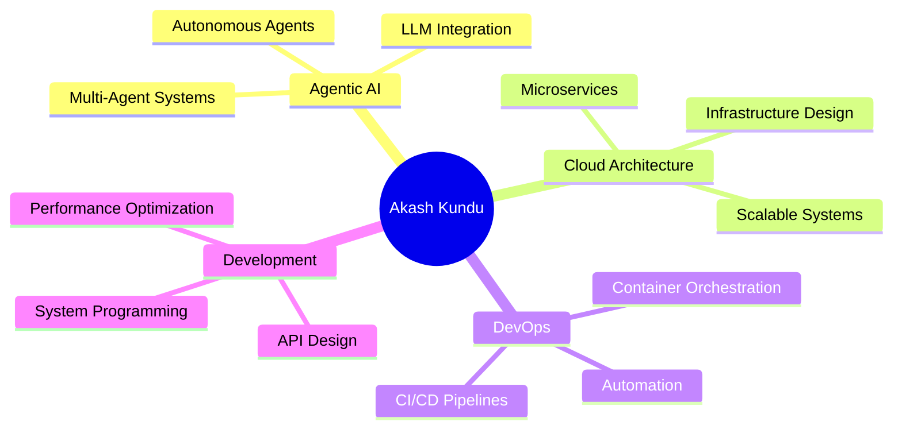

# 👋 Hi, I'm Akash Kundu

  
  

---

## 🚀 About Me

I'm a passionate technologist currently diving deep into **Agentic AI** while building expertise in **Cloud Architecture** and **DevOps**. I believe in creating intelligent, scalable systems that solve real-world problems.

- 🤖 **Currently Learning:** Agentic AI & Autonomous Systems
- ☁️ **Interested In:** Cloud Architecture, DevOps, Infrastructure as Code
- 🛠️ **Building:** AI-powered applications and cloud-native solutions
- 🌱 **Growing:** Exploring the intersection of AI and cloud infrastructure
- 💡 **Philosophy:** Automate everything, optimize relentlessly

---

## 🛠️ Tech Stack

### **Languages**

### **DevOps & Cloud**

### **Design & Prototyping**

### **AI & Machine Learning**

---

## 📊 GitHub Statistics

  
  
  
  

  
  
  
  

---

## 🏆 GitHub Trophies

  
  

---

## 🎯 Current Focus Areas

---

## 📈 Contribution Activity

  
  

---

## 🌟 Featured Projects

<!-- Add your pinned repositories here -->

  
  

> **Note:** something is coming !

---

##  Connect With Me

  
  
  
  
  
  

---

## 💭 Quote of the Day

  
  

---

## 📊 Profile Views

  
  

---

  
  ### 🚀 "Building the future, one commit at a time"
  
  

